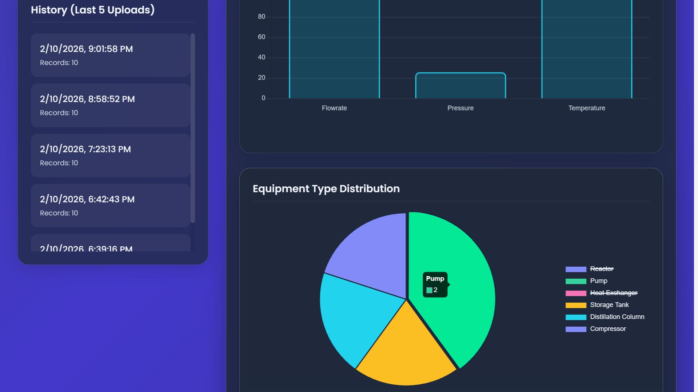
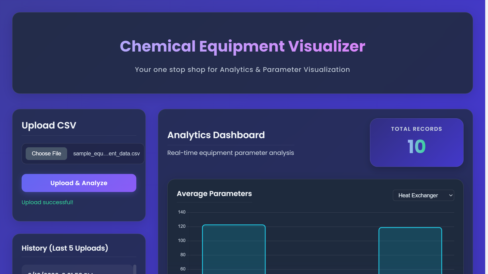
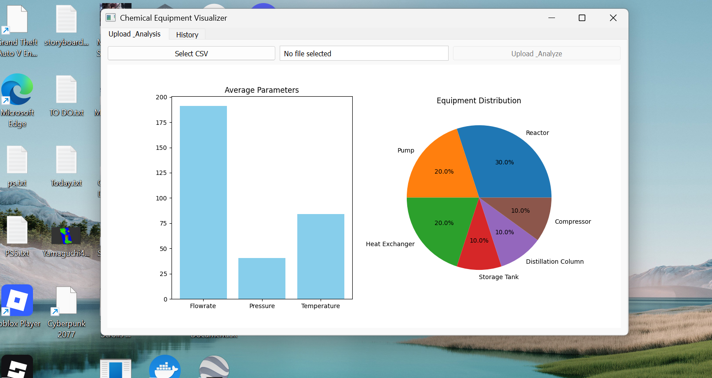

# Chemical Equipment Parameter Visualizer

A modern, hybrid web and desktop application for analyzing and visualizing chemical equipment data.

**Deployment link**: [https://lab-equipment-data-analyser-fronten.vercel.app/](https://lab-equipment-data-analyser-fronten.vercel.app/)


*Analysis View*

## Features
- **CSV Upload**: Inspect and analyze equipment data files.
- **Analytics Dashboard**:
  - Real-time calculation of averages and distribution.
  - Interactive charts (Bar & Pie).
  - **Category Filtering**: Drill down averages by equipment type.
- **History**: Tracks past uploads for quick access.
- **Multi-Platform**:
  - **Web**: React (Vite) + Chart.js with responsive Glassmorphism UI.
    - **Live Demo**: [https://lab-equipment-data-analyser-fronten.vercel.app/](https://lab-equipment-data-analyser-fronten.vercel.app/)
  - **Desktop**: Python (PyQt5) + Matplotlib for local usage.
  - **Backend**: Django REST Framework + Pandas for robust data processing.

## Documentation
- [API Routes](docs/api_routes.md): Detailed API documentation.

## Quick Start

For detailed setup instructions for Backend, Web, and Desktop, please refer to the **[Setup Guide](docs/setup.md)**.

### Brief Overview
```bash
# 1. Backend
cd backend && pip install -r requirements.txt && python manage.py runserver

# 2. Frontend
cd frontend-web && npm install && npm run dev
```

## Deployment
Currently deploying the Backend to **Render** and Frontend to **Vercel**.

## Mobile Access
See [Setup Guide](docs/setup.md#mobile-access-configuration).

## Sample Data
Use `sample_equipment_data.csv` located in the root directory for testing.

## Screenshots


*Dashboard Overview*


*Analysis View*


*Upload Interface*
